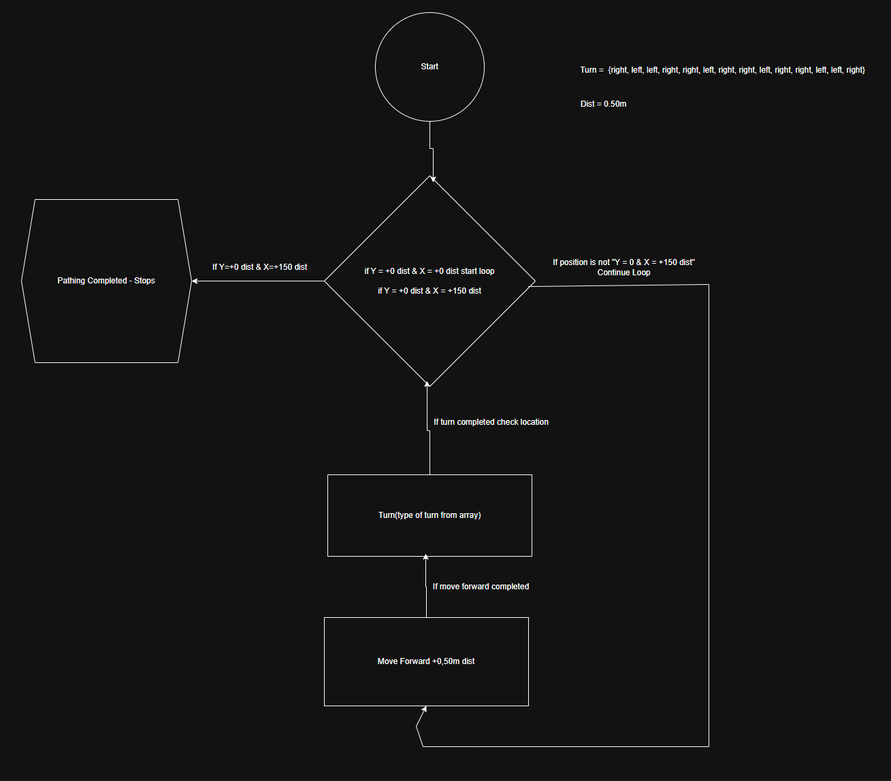

**Verkefni 1**

    Port 1 = Left Front Wheel
    port 2 = ??
    port 3 = Right Front Wheel
    port 4 = Claw open/close
    port 5 = Arm controller
    port 6 = ??
    port 7 = ??
    port 8 = ??
    port 9 = ??
    port 10 = ??
    port 20 = inertia sensor

**Video demonstration of part 1**
 
The GIF can take up to 30 seconds to load, blame GITHUB
 

**Video Demonstration of part 2**
 
The GIF can take up to 30 seconds to load, blame GITHUB
 
