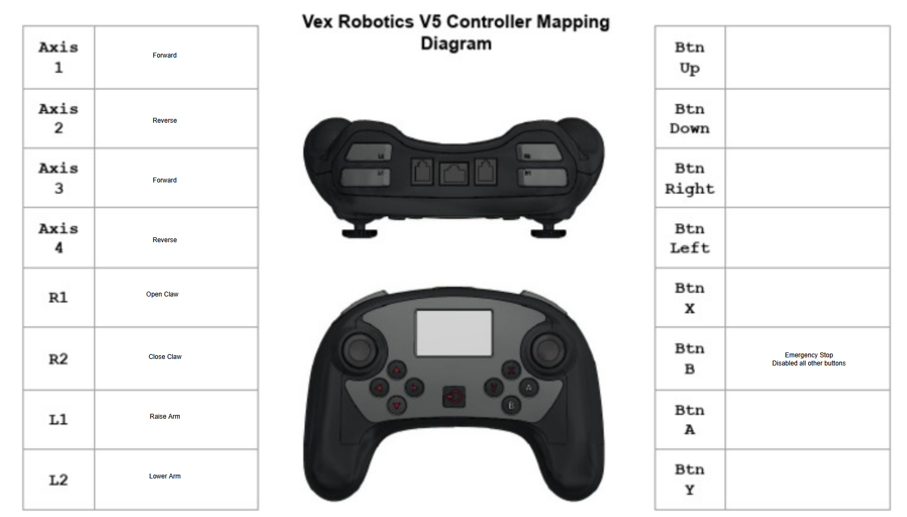
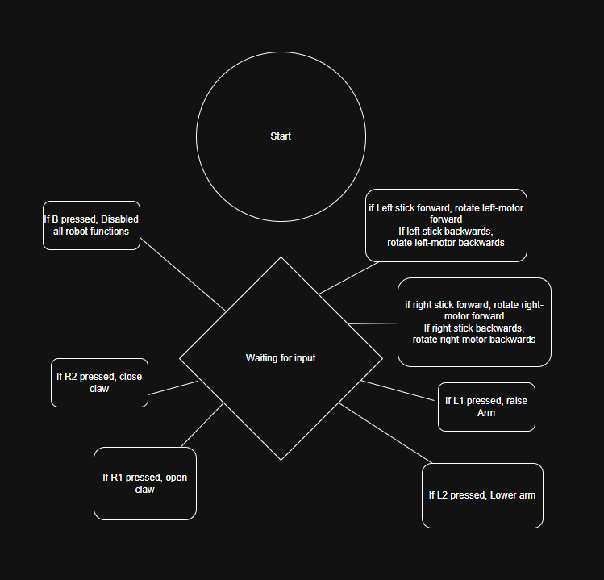

# VEX Controller Key Mapping

## Arm Controls
| Button | Action         |
|--------|----------------|
| **L1** | Raise Arm      |
| **L2** | Lower Arm      |

## Claw Controls
| Button | Action         |
|--------|----------------|
| **R1** | Open Claw      |
| **R2** | Close Claw     |

## Drive Controls
| Control Stick           | Action                      |
|-------------------------|-----------------------------|
| Left Stick Forward      | Left Motor Forward (Axis 1) |
| Left Stick Backward     | Left Motor Backward (Axis 2)|
| Right Stick Forward     | Right Motor Forward (Axis 3)|
| Right Stick Backward    | Right Motor Backward (Axis 4)|

## D-Pad
| Direction | Action  |
|-----------|---------|
| Up        | —       |
| Down      | —       |
| Left      | —       |
| Right     | —       |

## Face Buttons
| Button | Action |
|--------|--------|
| X      | —      |
| Y      | —      |
| A      | —      |
| B      | Emergency Brake (disables controller & stops all mobility) |

---

