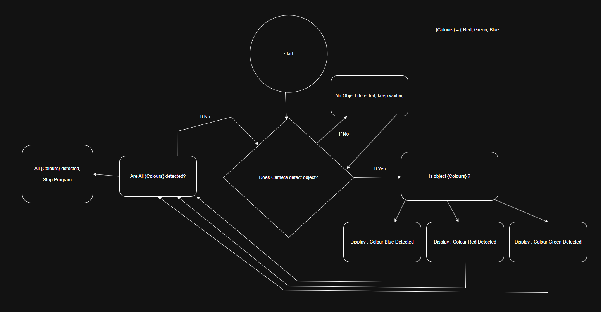

# Sonic Sensor & Light Sensor Pathing

---

Robot_movement_avoids_obstacles_shuts_off_in_ldarkness_turns_on_in_light
(https://streamable.com/6ugxgw)

# Colour Detection by Camera + Vision(camera view in phone)
## No Example Video. -Teacher saw and verified function.

# Following a Pre-Determined Colour

robot_movements(https://streamable.com/d8ywpg)

robot_screen_notifications(https://streamable.com/xh2ckg)
